> Making technology hygienic, accessible, and intuitive through touchless interaction.

---

## Acknowledgements


**Project by Siddhant (sidd-zero)**

**Original Team - Gesture Squad:**
* Swaraj Lakhe
* Siddharth Dwivedi
* Pushkar Wankhede
* Yash Daryani


---

## Overview

**KAIROS** is a next-generation universal smart remote that revolutionizes multi-device control through intelligent gesture recognition and seamless device switching. Unlike traditional Bluetooth remotes limited to a single device connection, KAIROS features an innovative triple device profile switching system that allows seamless control of up to three separate computers by dynamically changing its Bluetooth identity through ESP32 MAC address modification.

Built on the MYOSA Mini Kit and enhanced with advanced environmental sensing capabilities, this device operates in seven specialized modes designed for modern computing workflows. Each mode leverages sophisticated gesture recognition, precision motion sensing, and proximity detection to provide completely touchless operation across diverse applications from professional presentations to social media browsing.

The innovation device switching system is based on the ESP32 MAC address modification that allows making several different Bluetooth profiles which are stored in non-volatile memory. The two seconds hold gesture enables users to switch between controlling their work laptop and personal computers on a single touch. The profile of choice is retained across re-boots and also power cycles, it is such that the remote will always connect to the desired device without having to re-pair it manually.

The system includes automatic gyroscope calibration on startup, collecting 100 baseline readings over 1 second while the device remains stationary. This calibration routine eliminates gyroscopic drift and ensures pixel-perfect cursor control throughout extended usage sessions. The calibration values for X, Y, and Z axes are calculated as offsets and applied to all real-time motion data, providing drift-free precision air mouse functionality.

This versatile system is ideal for multi-device professionals managing work and personal computers simultaneously, content creators switching between editing and streaming setups, presenters controlling both presentation and backup laptops, developers managing multiple development environments, and anyone seeking to eliminate desktop clutter while maintaining full control over multiple systems with a single elegant device.

The best thing about it is the breath-to-wake system, where the alteration of air pressure is used to signal a user that the user is almost exhaling and therefore the device will wake the remote as well as the attached computer out of sleep mode. This renders KAIROS especially useful in a medical setting, laboratory, and accessibility uses where the ability to operate without touch is required.

KAIROS will also go into sleep mode after 30 seconds of idle time to save power. A single inhalation by the pressure sensor causes an intelligent wake program that sends the remote and the host computer into action with universal keyboard and mouse keys which work with Windows, MacOS and Linux operating systems.

**Key features:**
* Seven operational modes: Mouse, Media, Reels, Slides, Camera, Reader, and Environment
* Triple-device profile switching with persistent non-volatile storage
* Breath-detection wake system using BMP180 barometric pressure sensor
* Real-time OLED display with mode-specific interfaces and visual feedback
* Bluetooth Low Energy HID connectivity emulating both keyboard and mouse
* Shake-to-exit gesture for quick mode switching across all modes
* Environmental monitoring with temperature, pressure, and altitude calculation
* Smart sleep mode with 30-second inactivity timeout
* Universal computer wake commands compatible with all major operating systems
* Automatic gyroscope calibration for drift-free precision control
* Hold-duration detection for multi-function proximity inputs
* Adaptive scroll speed in Reader mode responding to tilt intensity
* Professional laser pointer simulation in Presentation mode

---

## Demo / Examples

### **Images**

#### **Main Unit**
<p align="center">
  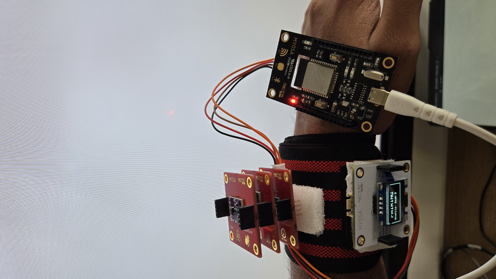<br/>
  <strong><i>KAIROS: No Interaction Hub</i></strong>
</p>

---

#### **Hardware Architecture**
<div style="display: grid; grid-template-columns: 1fr 1fr; gap: 20px; text-align: center;">
  <div>
    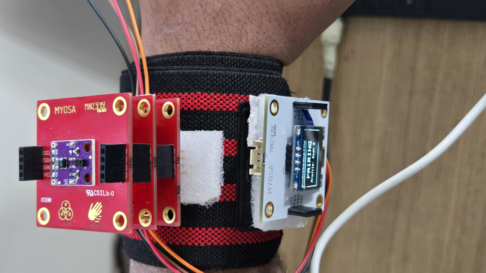
    <p><i>Top Architecture: Sensor Array</i></p>
  </div>
  <div>
    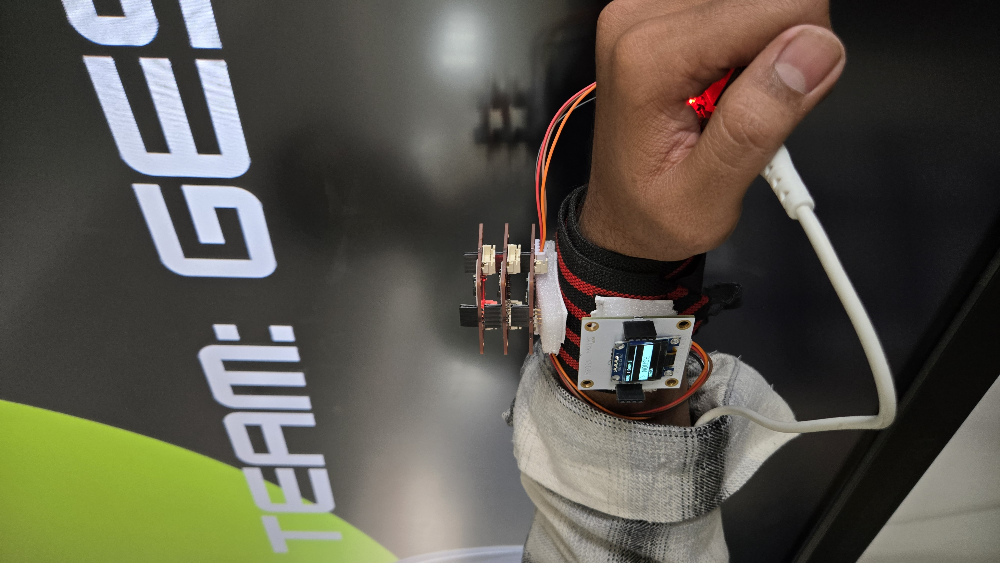
    <p><i>Side Profile</i></p>
  </div>
</div>

---

#### **Operational Modes (User Interface)**
<div style="display: grid; grid-template-columns: 1fr 1fr; gap: 20px; text-align: center;">
  <div>
    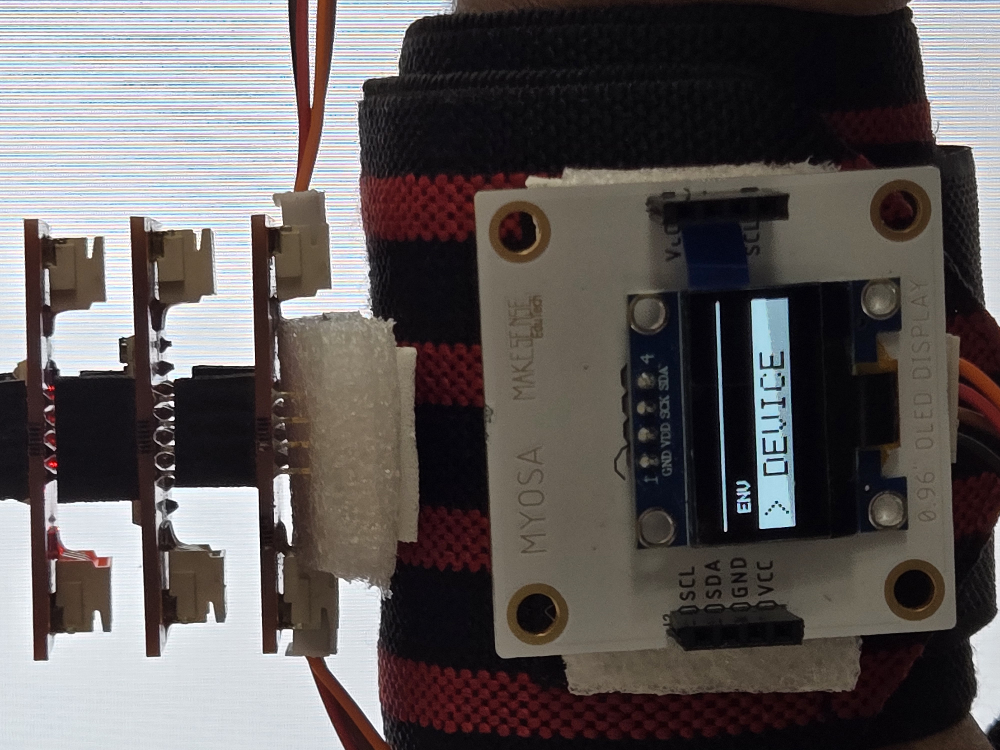
    <p><strong><i>Device Mode</strong></i></p>
  </div>
  <div>
    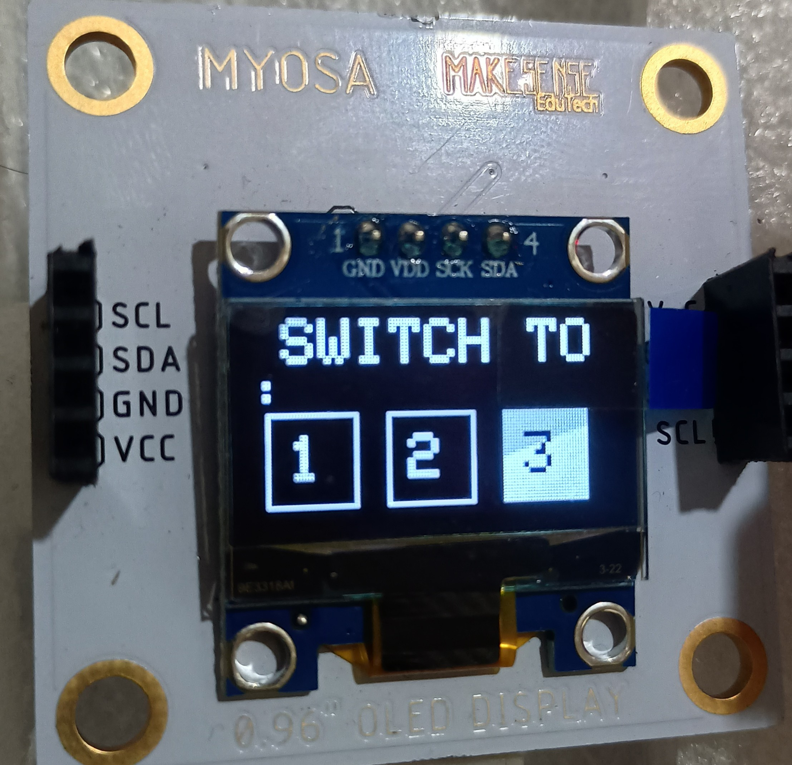
    <p><strong><i>Device Selection</i></strong></p>
  </div>
  <div>
    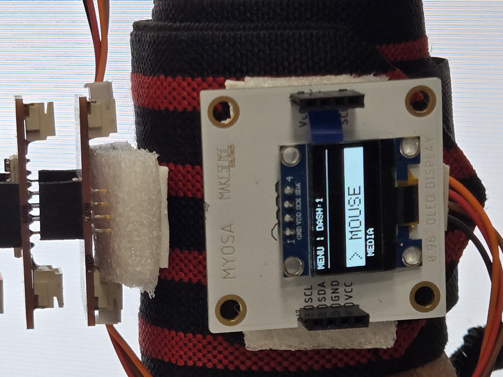
    <p><strong><i>Mouse Mode</i></strong></p>
  </div>
  <div>
    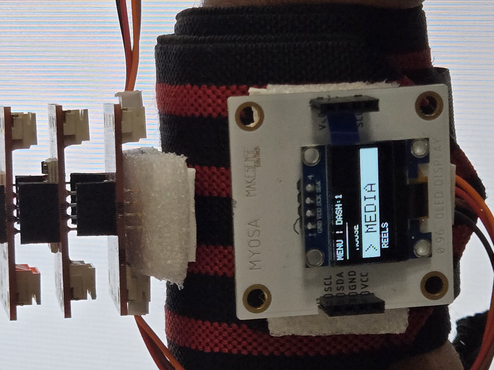
    <p><strong><i>Media Mode</i></strong></p>
  </div>
  <div>
    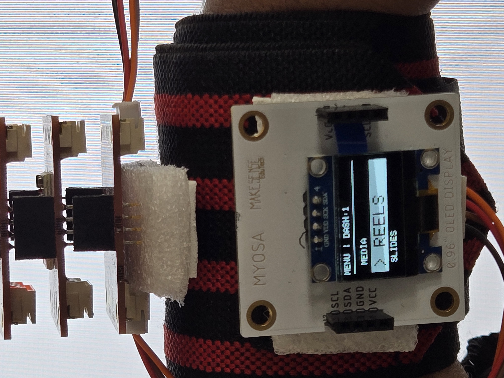
    <p><strong><i>Reels Mode</i></strong></p>
  </div>
  <div>
    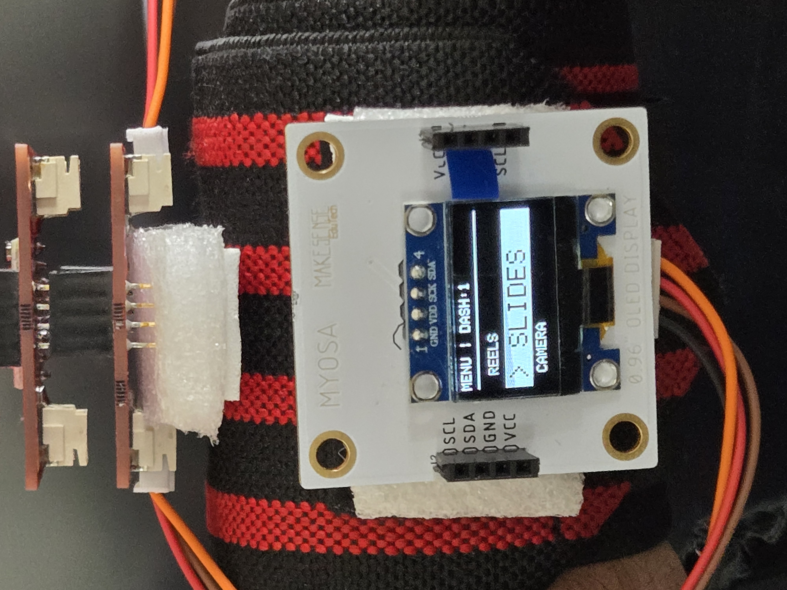
    <p><i><strong>Presentation Mode</i></strong></p>
  </div>
  <div>
    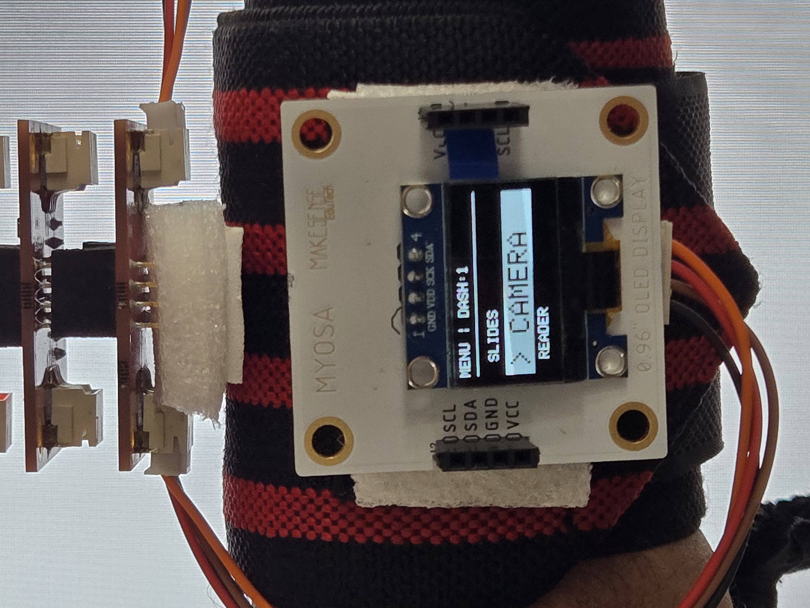
    <p><strong><i>Camera Mode</i></strong></p>
  </div>
  <div>
    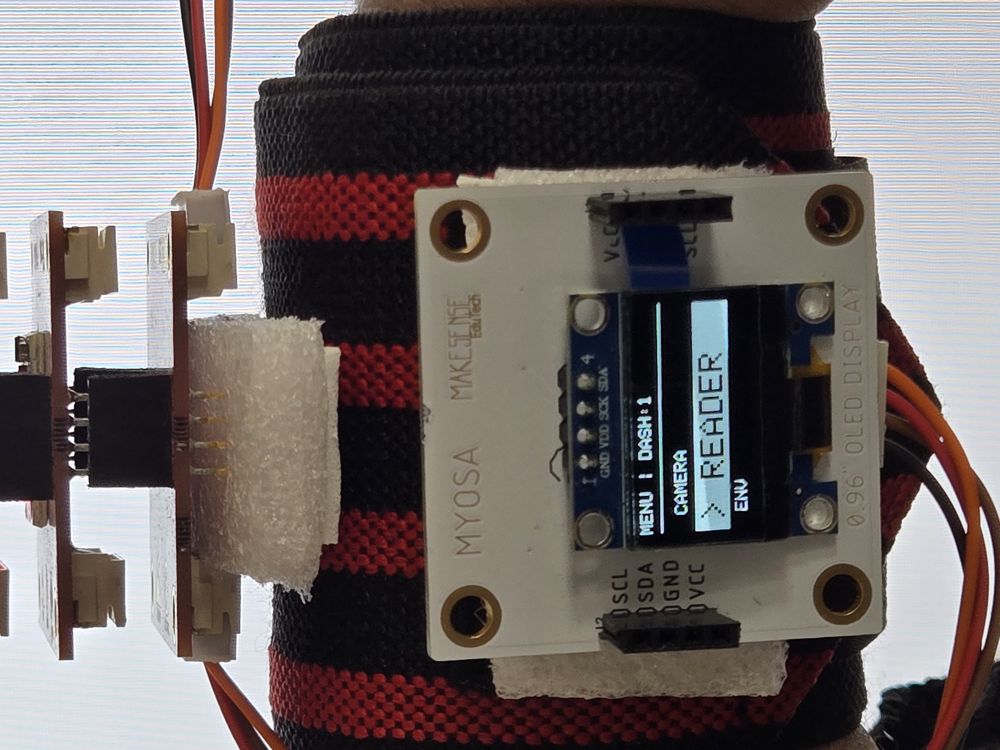
    <p><strong><i>Reader Mode</i></strong></p>
  </div>
  <div>
    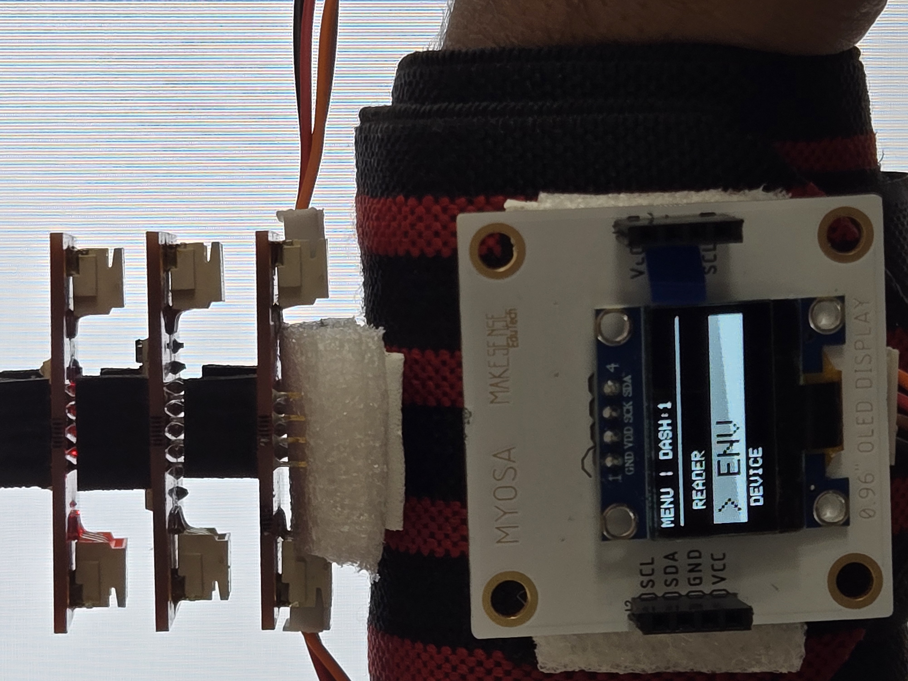
    <p><strong><i>Environment Sensing</i></strong></p>
  </div>
</div>

### **VIDEO**

<video controls width="100%"> 
<source src="video/kairos-full-detailed-demonstration.mp4" type="video/mp4"> 
</video>

---

## Features (Detailed)

KAIROS combines seven specialized control modes with an innovative triple-device management system. Each component is meticulously optimized for specific workflows while maintaining completely touchless operation and intuitive user experience.

**1. REVOLUTIONARY TRIPLE-DEVICE SWITCHING SYSTEM**
The defining feature that distinguishes KAIROS from all existing Bluetooth remotes. The system enables one remote to control three completely separate computers in true multi-device fashion, eliminating the limitations of traditional Bluetooth single-connection architecture.

**Technical Implementation:**

MAC Address Modification: The system utilizes hardware-level modifications to alter the ESP32 MAC address, generating three distinct Bluetooth identities.

Identity Management: Each identity is displayed as an individual combo device by paired computers, eliminating the need to unpair and re-pair when switching machines.

Persistent Storage: Device profiles are managed via the ESP32 Preferences library using non-volatile flash memory with wear-leveling protection.

Switching Logic: When a profile is changed, the system saves the selection, modifies the address via setDeviceIdentity(), and reboots to reinitialize the Bluetooth stack.

**User Experience:**

Quick Switch: Maintaining close proximity to the APDS9960 sensor for 2+ seconds from the dashboard cycles through Device 1 → 2 → 3 automatically.

Visual Menu: Users can navigate to the DEVICE menu to see three profile boxes on the OLED; tilting left/right highlights the profile, and a proximity gesture confirms it.

Status Header: The active profile is permanently displayed as "MENU | DASH:X" to prevent accidental commands on the wrong computer.

**2. PROFESSIONAL AIR MOUSE WITH DRIFT-FREE CALIBRATION**
A precision air mouse system with productivity-focused gesture shortcuts, designed for extended usage sessions requiring pixel-perfect cursor control and reliable performance.

**Calibrated Motion Control:**

Boot-Cycle Calibration: Performs 100 sequential measurements over 1 second on every startup while the device is stationary.

Offset Calculation: Calculates average offset values for X, Y, and Z axes to eliminate the inherent bias found in MEMS sensors.

User Guidance: Displays "CALIBRATING... DON'T MOVE!" to ensure the device remains on a level surface for precise floating-point offset storage.

**Advanced Filtering System:**

Deadzone Filter: Implements a 0.08 rad/s threshold to treat micro-jitters and hand tremors as zero movement.

Sensitivity: Uses a 25x sensitivity multiplier to balance fast screen traversal with pixel-accurate fine adjustments.

HID Constraints: Movement values are constrained to ±127 to prevent integer overflow glitches during rapid motion.

**Productivity Gesture Shortcuts & Click Detection:**

Gestures: Swipe Left (Copy), Swipe Right (Paste), Swipe Up (Window Switch/Alt+Tab), and Swipe Down (Show Desktop).

Proximity Triggering: Left-click activates when a hand enters the 5–10cm range of the APDS9960 sensor, supported by a "CLICK" visual indicator on the OLED.

Drag Support: Clicks remain active while the hand is in range, allowing for natural drag-and-drop operations.

**3. MEDIA CENTER MODE WITH HOLD-DURATION DETECTION**
An advanced media controller featuring gesture-based navigation combined with smart hold-duration detection for complex functions like play/pause and mute.

**Gesture Controls:**

Mapping: Swipe Up/Down for Volume control and Swipe Right/Left for track navigation.

Compatibility: Uses standardized HID media keys compatible with Spotify, YouTube, VLC, and most browser players.

Debounce Logic: Track navigation includes a 500ms confirmation delay to prevent accidental double-skips.

**Intelligent Hold-Duration System:**

Visual Feedback: A 128-pixel progress bar fills on the OLED over 5 seconds during a proximity hold.

Logic: A 3–5 second hold triggers Play/Pause; a 5+ second hold triggers Mute/Unmute.

Abort Mechanism: Users can cancel a command mid-hold by simply shaking the device.

**4. REELS AND GALLERY MODE - SOCIAL MEDIA OPTIMIZED**
A dedicated mode specifically designed for modern short-form video content and image galleries, mirroring navigation patterns found on TikTok, Instagram, and YouTube Shorts.

**Inverted Video Navigation:**

Internalized Mapping: Gesture mapping is deliberately inverted vertically (Swipe Up sends ↓ arrow) to conform to mobile social media scrolling conventions.

Visual Confirmation: The OLED displays "REELS: NEXT VIDEO" for 300ms to confirm execution without obscuring the content.

**Horizontal Gallery Navigation & Quick Pause:**

Gallery: Horizontal swipes (Left/Right) advance or return through images in software like Windows Photo Viewer or Pinterest.

Rapid Toggle: A short 400ms proximity hold triggers a spacebar press to pause or play video content instantly.

**5. PRESENTATION MODE - PROFESSIONAL SLIDE CONTROL**
A comprehensive presentation control solution integrating slide navigation, professional laser pointer simulation, and dynamic zoom functionality.

**Slide Navigation & Dynamic Zoom:**

Navigation: Horizontal swipes control slide advancement with 500ms debouncing. Swipe Up sends F5 (Start) and Swipe Down sends ESC (Exit).

Zoom Control: Tilting the device right or left triggers Zoom In (Ctrl++) or Zoom Out (Ctrl+-), allowing presenters to highlight specific data points in charts.

**Laser Pointer Simulation:**

Authentic Integration: Bringing the palm near the sensor activates the Ctrl + Left Mouse Button combination—PowerPoint’s native laser pointer trigger.

Precision: Gyroscope data continues to process, but sensitivity is reduced by 5 units to provide enhanced pointing accuracy during the laser mode.

**6. CAMERA MODE - TIMER PHOTOGRAPHY CONTROL**
A hands-free camera control system featuring countdown timer functionality and seamless mode switching for solo content creators.

**Countdown Timer System:**

Operation: Swiping up/down activates a 5-second countdown on the OLED (Size-4 font) for high visibility from a distance.

Trigger: Upon reaching zero, the system sends an Enter keypress to trigger the shutter in the Windows Camera app or webcam software.

**Mode Switching & Framing:**

Switching: Horizontal swipes toggle between "MODE: VIDEO" and "MODE: PHOTO."

Integration: KAIROS automatically launches the Windows Camera app via a Win+Type sequence upon entering this mode.

Framing: The air mouse remains active during the countdown, allowing users to adjust UI elements or framing until the final capture.

**7. READER MODE - ADAPTIVE TILT-BASED SCROLLING**
An ergonomic document reading mode featuring variable-speed scrolling controlled by device tilt intensity, designed for extended hands-free reading sessions.

**Intelligent Tilt-Based Scrolling:**

Mapping: The system monitors the Y-axis accelerometer. Once tilt exceeds a 3.0 m/s² deadzone, scrolling begins.

Exponential Scaling: Uses map(constrain(abs(tiltY), 3.0, 9.0), 3.0, 9.0, 120, 10) to scale scroll speed from a slow reading pace to rapid navigation based on how steep the device is tilted.

**Precision & Page Navigation:**

Visual Indicators: OLED displays "DOWN ▼" or "UP ▲" to confirm tilt input recognition.

Page Jumps: Horizontal swipes provide instant Page Up/Page Down commands for traversing long PDFs or eBooks.

**8. ENVIRONMENT MODE - REAL-TIME ATMOSPHERIC MONITORING**
A diagnostic and demonstration mode displaying real-time environmental data from the integrated BMP180 sensor.

**Sensor Measurements:**

Data Points: Displays Temperature (°C), Pressure (hPa), and calculated Altitude at 1-second intervals.

Accuracy: Temperature is accurate to ±2°C; pressure resolution is sufficient for monitoring local weather trends or elevation gain.

**Professional Layout:**

Interface: A white-on-black inverted header bar provides high legibility for lab or outdoor environments.

Usage: Serves as a hardware health check to verify I2C communication and sensor integrity.

**9. BREATH-TO-WAKE SYSTEM - TOUCHLESS ACTIVATION**
The signature feature of KAIROS—automatic wake detection through atmospheric pressure changes, enabling completely touchless activation from sleep mode.

**Technical Implementation:**

Monitoring: While in Sleep Mode, the system samples pressure at 100ms intervals. Exhaling near the sensor creates a pressure spike exceeding 30 Pascals above the baseline.

Adaptive Baseline: Uses a 95/5 weighted average (baselinePressure = (baselinePressure * 0.95) + (currentP * 0.05)) to track weather changes without triggering false wakes.

**Wake Protocol:**

Routine: The device wakes the host computer by sending a ±15 pixel mouse shake and a Control key toggle, ensuring compatibility across Windows, macOS, and Linux.

**10. SMART SLEEP AND ACTIVITY TRACKING**
Intelligent power management that extends battery life while maintaining instant responsiveness.

**Logic & Preservation:**

Inactivity: If no input or motion (>2 rad/s) is detected for 30 seconds (SLEEP_TIMEOUT), the system enters SLEEP_MODE and shuts off the OLED.

Clean State: All mouse buttons and keyboard modifiers are released before sleeping to prevent "stuck keys" on the host PC.

State Preservation: The active device profile is stored in the Preferences library, ensuring KAIROS reconnects to the correct computer after waking.

## Usage Instructions

### **Getting Started**

1. **Power On**: Connect KAIROS to USB power (5V, 500mA minimum)
2. **Wait for Boot**: Display shows "SYSTEM ONLINE" during initialization
3. **Pair Bluetooth**: 
   - Open Bluetooth settings on your computer
   - Look for "KAIROS"
   - Connect
4. **Navigate Menu**: Device boots to main dashboard automatically

### **Dashboard Navigation**

```plaintext
Tilt Left/Right → Scroll through 6 modes
Hand Proximity → Select highlighted mode
Shake Device → Return to dashboard from any mode
```

### **Mode-Specific Commands**

**MOUSE MODE:**
```plaintext
Tilt Device       → Move cursor
Hand Close        → Left click
Swipe ← → ↑ ↓    → Copy/Paste/Tab/Desktop
Shake             → Exit to menu
```

**MEDIA MODE:**
```plaintext
Swipe ↑ ↓        → Volume up/down
Swipe ← →        → Skip backward/forward
Hold 3s          → Play/Pause
Hold 5s          → Mute
Shake            → Exit to menu
```

**SLIDES MODE:**
```plaintext
Swipe → ←        → Next/Previous slide
Swipe ↑          → Start presentation (F5)
Swipe ↓          → End presentation (ESC)
Tilt → ←         → Zoom in/out
Hand Close       → Laser pointer
Shake            → Exit to menu
```

**CAMERA MODE:**
```plaintext
Swipe ↑ or ↓     → Start 5s countdown
Swipe →          → Video mode
Swipe ←          → Photo mode
Shake            → Exit & close camera app
```

**READER MODE:**
```plaintext
Tilt Forward     → Scroll down (variable speed)
Tilt Backward    → Scroll up (variable speed)
Swipe →          → Page down
Swipe ←          → Page up
Shake            → Exit to menu
```

**ENVIRONMENT MODE:**
```plaintext
Auto-Display     → Temp, Pressure, Altitude
Updates          → Every 1 second
Shake            → Exit to menu
```

### **Sleep & Wake**

```plaintext
Inactivity (30s) → Enters sleep mode
Exhale Near      → Wakes remote & computer
Screen Off       → Indicates sleep mode
```

### **Configuration Options**

Customize sensitivity and timings in the code:

```cpp
// Sensitivity Settings
#define SHAKE_THRESHOLD 14.0          // Shake detection (default: 14.0 m/s²)
#define TILT_MENU_THRESHOLD 4.5       // Menu navigation (default: 4.5 m/s²)
#define TILT_SCROLL_DEADZONE 3.0      // Reader scroll deadzone (default: 3.0)
#define PROX_TRIGGER 50               // Proximity click trigger (default: 50)
#define MOUSE_SENSITIVITY 15          // Cursor speed multiplier (default: 15)

// Timing Settings
#define SLEEP_TIMEOUT 30000           // Sleep after 30 seconds (default: 30000 ms)
#define BREATH_THRESHOLD 30           // Breath detection (default: 30 Pa)
#define MENU_SCROLL_DELAY 350         // Menu scroll speed (default: 350 ms)
```

---

## Tech Stack

* **ESP32 Microcontroller** - Dual-core processor with Bluetooth LE 4.2 and Wi-Fi
* **MPU6050** - 6-axis accelerometer and gyroscope for motion tracking
* **APDS9960** - RGB, proximity, and gesture sensor with I2C interface
* **BMP180** - Barometric pressure and temperature sensor for breath detection
* **SSD1306 OLED** - 128x64 monochrome display with I2C communication
* **BleCombo Library** - Bluetooth HID keyboard and mouse emulation
* **Arduino Framework** - Development platform with ESP32 support
* **C++** - Primary programming language
* **I2C Protocol** - Inter-sensor communication bus (400 kHz)

---

## Requirements / Installation

### **Hardware Requirements**

* MYOSA Mini Kit (includes ESP32, MPU6050, APDS9960, SSD1306)
* BMP180 pressure sensor module
* USB power cable (micro-USB or USB-C depending on ESP32 board)
* Computer with Bluetooth 4.0+ (Windows 10/11, macOS 10.12+, or Linux)

### **Wiring Connections**

```plaintext
ESP32 GPIO 21  →  SDA (all I2C devices)
ESP32 GPIO 22  →  SCL (all I2C devices)
ESP32 3.3V     →  VCC (all sensors)
ESP32 GND      →  GND (all sensors)

I2C Addresses:
- SSD1306 OLED:  0x3C
- MPU6050:       0x69 or 0x68 (auto-detect)
- APDS9960:      0x39 (default)
- BMP180:        0x77 (default)
```

### **Software Dependencies**

Install the following libraries via Arduino IDE Library Manager:

```bash
# Core Libraries
Adafruit GFX Library          # Graphics primitives
Adafruit SSD1306              # OLED display driver
Adafruit MPU6050              # Motion sensor
Adafruit Unified Sensor       # Sensor abstraction
Adafruit BMP085 Unified       # Pressure sensor (works with BMP180)
ESP32-BLE-Combo               # Bluetooth keyboard & mouse
LightProximityAndGesture      # APDS9960 gesture library

# Board Support
ESP32 Board Package           # Install via Boards Manager
```

### **Arduino IDE Setup**

1. Open Arduino IDE (version 1.8.13+ or 2.x)
2. Go to **File → Preferences**
3. Add ESP32 board manager URL:
```plaintext
https://dl.espressif.com/dl/package_esp32_index.json
```
4. Go to **Tools → Board → Boards Manager**
5. Search for "esp32" and install "esp32 by Espressif Systems"
6. Install all required libraries via **Tools → Manage Libraries**

### **Upload Instructions**

```bash
# 1. Connect ESP32 via USB
# 2. Select board: Tools → Board → ESP32 Dev Module
# 3. Select port: Tools → Port → (your COM port)
# 4. Configure board settings:
#    - Upload Speed: 921600
#    - CPU Frequency: 240MHz
#    - Flash Frequency: 80MHz
#    - Flash Mode: QIO
#    - Flash Size: 4MB
# 5. Click Upload button or Sketch → Upload```
---

This final technical section provides everything needed to build and configure your own **KAIROS** remote. I have formatted the installation steps and troubleshooting guide into scannable modules and added diagrams to clarify the complex wiring and software setup.

---

## Requirements / Installation

### **Hardware Requirements**

**Essential Components:**

* **MYOSA Mini Kit:** (ESP32, MPU6050, APDS9960, and SSD1306 OLED).
* **BMP180 Sensor:** For barometric pressure and breath-to-wake functionality.
* **Power:** 5V stable source (500mA min) via USB.

**Computer Requirements:**

* Bluetooth 4.0+ capability on host machines.
* OS: Windows 10/11, macOS 10.12+, or Linux (BlueZ).

### **Wiring Configuration**

All sensors communicate via a shared **I2C bus**.

**Pin Layout:**

* **GPIO 21 (SDA):** Connect to all sensor SDA pins.
* **GPIO 22 (SCL):** Connect to all sensor SCL pins.
* **3.3V:** Power rail for all sensors.
* **GND:** Common ground.

**I2C Addresses:**

* **OLED:** 0x3C | **MPU6050:** 0x68/0x69 | **APDS9960:** 0x39 | **BMP180:** 0x77.

---

### **Software Installation**

**Step 1: Arduino IDE Setup**

* Install Arduino IDE (1.8.13+).
* Add ESP32 support via Preferences URL: `https://dl.espressif.com/dl/package_esp32_index.json`.

**Step 2: Library Management**
Install these via the Library Manager:

* **Adafruit GFX & SSD1306** (Display)
* **Adafruit MPU6050 & Unified Sensor** (Motion)
* **Adafruit BMP085 Unified** (Pressure)
* **ESP32-BLE-Combo** (Bluetooth HID)
* **APDS-9960** (Gestures)

**Step 3: Uploading Firmware**

* **Board:** "ESP32 Dev Module"
* **Partition Scheme:** Default 4MB with SPIFFS.
* **Process:** Click **Upload**. If it fails to connect, hold the **BOOT** button on the ESP32 until the status changes to "Connecting...".

---

### **First-Time Pairing Guide**

* **Device 1:** Power on → Wait for "PAIRING" → Connect "Kairos" on Computer 1.
* **Device 2:** Hold proximity for 2s on Dashboard → Reboot → Pair on Computer 2.
* **Switching:** A simple 2-second proximity hold on the dashboard cycles between your paired machines.

---

### **Troubleshooting**

| Issue | Potential Solution |
| --- | --- |
| **Upload Fails** | Hold BOOT button during upload; lower baud rate to 115200. |
| **Sensor Not Found** | Check I2C wiring; run an I2C scanner sketch to verify addresses. |
| **Cursor Drift** | Place device on a perfectly flat surface during the 1-second boot calibration. |
| **No Gestures** | Ensure hand is 5-10cm away; check APDS9960 VCC/GND connections. |
| **Bluetooth Error** | Delete "Kairos" from PC settings and re-pair from scratch. |

---

## File Structure

```plaintext
/kairos-no-interaction-hub/
├─ image/                   # Media Files
│  ├─ Top.jpg               # Hardware Layout
│  ├─ SideView.jpg          # Ergonomics
│  ├─ Device.jpg            # UI: Profile Switcher
│  ├─ Device-selection.jpg  
│  ├─ Mouse.jpg             # UI: Air Mouse
│  ├─ Media.jpg             # UI: Media Player
│  ├─ Reels.jpg             # UI: Social Media
│  ├─ Slides.jpg            # UI: Presentation
│  ├─ Camera.jpg            # UI: Timer
│  ├─ Reader.jpg            # UI: Reader
│  ├─ Env.jpg               # UI: Environment
│  ├─ kairos-coverpage.jpg    
├─ video/
│  └─ kairos-demo.mp4      # Video Demo
└─ kairos.md                # Documentation


---

For questions, suggestions, or collaboration inquiries, contact the Gesture Squad team through the MYOSA community forum or submit issues on the project repository.

---


**Built with passion by Gesture Squad | Powered by MYOSA Mini Kit | 2025**

---

**This repository is maintained and published by Siddhant (sidd-zero).**
